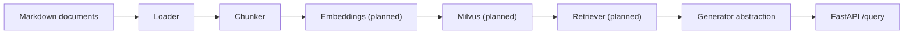

# Enterprise Knowledge Assistant

[](https://www.python.org/)
[](https://fastapi.tiangolo.com/)
[](https://www.mkdocs.org/)
[](https://docs.pytest.org/)
[](https://docs.astral.sh/ruff/)
[](https://docs.astral.sh/uv/)

A production-oriented RAG project that simulates an internal enterprise
knowledge assistant. The system ingests internal company documentation stored
as markdown, prepares retrieval-ready chunks, and exposes a clean FastAPI
backend that will later be connected to Milvus and a pluggable LLM provider.

## Why this project

This repository is designed as an **applied AI engineering portfolio project**,
not a notebook demo. The goal is to show:

- backend engineering with FastAPI
- modular RAG pipeline design
- document ingestion from structured internal docs
- source-aware answer generation contracts
- testing, linting, and development discipline
- readiness for future deployment and feature branching

## Current status

The project is intentionally being built in small, production-minded steps.

- `FastAPI` app skeleton is working
- `GET /health` endpoint is implemented
- `POST /query` contract is implemented with a placeholder generator
- sample enterprise markdown corpus is present under `data/sample_docs/`
- markdown document loader is implemented
- chunking pipeline is implemented and tested
- Milvus, embeddings, retrieval, and grounded generation are planned next

## Implemented so far

| Area | Status | Notes |
| --- | --- | --- |
| API skeleton | Done | App wiring, routers, schemas, dependency layer |
| Health endpoint | Done | `GET /health` returns service status |
| Query contract | Done | `POST /query` returns the response shape we will keep |
| Sample knowledge base | Done | HR, IT, and compliance markdown documents |
| Markdown loader | Done | Extracts `document`, `category`, `path`, `title`, `content` |
| Chunker | Done | Produces traceable retrieval chunks with overlap |
| Vector DB integration | Planned | Milvus will be used next |
| Embeddings | Planned | `sentence-transformers` target |
| Retrieval | Planned | Top-k retrieval over vectorized chunks |
| Real answer generation | Planned | Provider abstraction already scaffolded |

## Architecture



<details>
<summary><strong>Current project structure</strong></summary>

```text
.
├── data/
│   └── sample_docs/
│       ├── compliance/
│       ├── hr/
│       └── it/
├── docs/
├── src/
│   └── enterprise_knowledge_assistant/
│       ├── api/
│       ├── core/
│       ├── rag/
│       └── services/
├── tests/
├── .env.example
├── Makefile
├── mkdocs.yml
├── pyproject.toml
└── README.md
```

</details>

## Quick start

### Prerequisites

- Python `3.14+`
- [`uv`](https://docs.astral.sh/uv/)

### Install

```bash
uv sync
```

### Run the API

```bash
make run-api
```

### Run tests

```bash
make test
```

### Serve the docs locally

```bash
make docs-serve
```

## API snapshot

### `GET /health`

Returns a simple health payload:

```json
{
  "status": "ok"
}
```

### `POST /query`

Current request contract:

```json
{
  "question": "What is the remote work policy?"
}
```

Current response shape:

```json
{
  "answer": "Generation is scaffolded but not implemented yet.",
  "sources": [
    {
      "document": "not_implemented_yet",
      "snippet": "Retrieval pipeline will provide source-backed snippets here."
    }
  ]
}
```

The important point here is that the response contract is already stable even
though the retrieval and generation internals are still being connected.

## Tooling

- `make run-api` launches the FastAPI server with auto-reload
- `make test` runs the test suite
- `make lint` runs Ruff checks
- `make docs-serve` runs the MkDocs site locally

## Documentation

Project documentation lives in [`docs/`](docs/) and includes:

- architecture overview
- current implementation status
- API contract
- development workflow for future feature branches

## Roadmap

<details>
<summary><strong>Next milestones</strong></summary>

- integrate Milvus as the open-source vector database
- add embeddings generation for chunks
- implement ingestion/indexing pipeline
- implement retrieval and source-backed query flow
- connect a real LLM provider through the generator abstraction
- add Streamlit UI
- add Docker and deployment configuration

</details>

## Development workflow

The repository will use a simple branch strategy after this initial baseline:

- `main` stays stable
- each new feature gets its own branch, for example:
  - `feature/milvus-ingestion`
  - `feature/retriever-pipeline`
  - `feature/streamlit-ui`

This first push is intended to establish a clean baseline before continuing
feature-by-feature.
