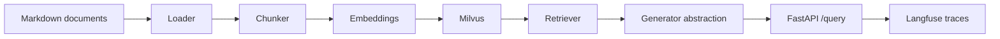

# Enterprise Knowledge Assistant

[](https://www.python.org/)
[](https://fastapi.tiangolo.com/)
[](https://www.mkdocs.org/)
[](https://docs.pytest.org/)
[](https://docs.astral.sh/ruff/)
[](https://docs.astral.sh/uv/)

A production-oriented RAG project that simulates an internal enterprise
knowledge assistant. The system ingests internal company documentation stored
as markdown, indexes them in Milvus, retrieves grounded context, and exposes a
clean FastAPI backend with pluggable LLM generation and Langfuse tracing.

## Why this project

This repository is designed as an **applied AI engineering portfolio project**,
not a notebook demo. The goal is to show:

- backend engineering with FastAPI
- modular RAG pipeline design
- document ingestion from structured internal docs
- source-aware answer generation contracts
- observability and tracing with Langfuse
- testing, linting, and development discipline
- readiness for future deployment and feature branching

## Current status

The project is intentionally being built in small, production-minded steps.

- `FastAPI` backend is working
- `GET /health`, `GET /health/database`, `POST /admin/index`, and `POST /query` are implemented
- sample enterprise markdown corpus is present under `data/sample_docs/`
- markdown loading, chunking, embeddings, Milvus ingestion, and retrieval are implemented
- `mock` and `openai` generation are supported
- Langfuse observability is integrated for the `/query` flow

## Implemented so far

| Area | Status | Notes |
| --- | --- | --- |
| API skeleton | Done | App wiring, routers, schemas, dependency layer |
| Health endpoints | Done | `GET /health` and `GET /health/database` |
| Query flow | Done | `POST /query` retrieves grounded sources and supports provider override |
| Indexing flow | Done | `POST /admin/index` runs load -> chunk -> embed -> ingest |
| Sample knowledge base | Done | HR, IT, and compliance markdown documents |
| Markdown loader | Done | Extracts `document`, `category`, `path`, `title`, `content` |
| Chunker | Done | Produces traceable retrieval chunks with overlap |
| Vector DB integration | Done | Milvus Lite locally, Milvus-ready architecture |
| Embeddings | Done | `sentence-transformers` for chunk and query embeddings |
| Retrieval | Done | Top-k semantic retrieval over indexed chunks |
| Real answer generation | Done | `mock` and `openai` providers |
| Observability | Done | Langfuse spans for query, retrieval, and generation |

## Architecture



## Langfuse observability

The query flow is instrumented with Langfuse so the project can trace:

- the incoming user question
- retrieval spans and matched source documents
- LLM generation spans
- provider and model selection per request


<details>
<summary><strong>Current project structure</strong></summary>

```text
.
├── data/
│   └── sample_docs/
│       ├── compliance/
│       ├── hr/
│       └── it/
├── docs/
├── src/
│   └── enterprise_knowledge_assistant/
│       ├── api/
│       ├── core/
│       ├── rag/
│       └── services/
├── tests/
├── .env.example
├── Makefile
├── mkdocs.yml
├── pyproject.toml
└── README.md
```

</details>

## Quick start

### Prerequisites

- Python `3.14+`
- [`uv`](https://docs.astral.sh/uv/)

### Install

```bash
uv sync
```

### Run the API

```bash
make run-api
```

### Configure environment

Copy the example file and set the values you need:

```bash
cp .env.example .env
```

Important variables:

- `OPENAI_API_KEY` for OpenAI-backed answers
- `OPENAI_MODEL_NAME` for the OpenAI model selection
- `LANGFUSE_PUBLIC_KEY` and `LANGFUSE_SECRET_KEY` for Langfuse tracing
- `LANGFUSE_BASE_URL` for your Langfuse region

### Run tests

```bash
make test
```

### Serve the docs locally

```bash
make docs-serve
```

## API snapshot

### `GET /health`

Returns a simple health payload:

```json
{
  "status": "ok"
}
```

### `GET /health/database`

Returns the status of the configured Milvus vector store.

### `POST /admin/index`

Runs the full local indexing pipeline:

- load markdown documents
- chunk documents
- build embeddings
- ingest records into Milvus

### `POST /query`

Current request contract:

```json
{
  "question": "What is the remote work policy?",
  "provider": "openai"
}
```

Current response shape:

```json
{
  "answer": "Employees may work remotely up to three days per week with manager approval.",
  "sources": [
    {
      "document": "remote_work_policy.md",
      "snippet": "Employees may work remotely up to three days per week..."
    }
  ]
}
```

## Tooling

- `make run-api` launches the FastAPI server with auto-reload
- `make test` runs the test suite
- `make lint` runs Ruff checks
- `make docs-serve` runs the MkDocs site locally

## Documentation

Project documentation lives in [`docs/`](docs/) and includes:

- architecture overview
- current implementation status
- API contract
- Langfuse observability notes
- development workflow for future feature branches

## Roadmap

<details>
<summary><strong>Next milestones</strong></summary>

- refine refusal behavior when context is weak
- expand Langfuse from tracing to prompt management and evaluations
- add Streamlit UI
- add Docker and deployment configuration
- add `/upload` and metadata filtering
- add evaluation scripts and experiments

</details>

## Development workflow

The repository will use a simple branch strategy after this initial baseline:

- `main` stays stable
- each new feature gets its own branch, for example:
  - `feature/refusal-behavior`
  - `feature/langfuse-evals`
  - `feature/streamlit-ui`

This repository is intentionally evolving feature-by-feature so the engineering
story remains easy to follow in code reviews, PRs, and portfolio walkthroughs.
